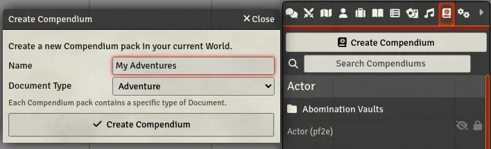
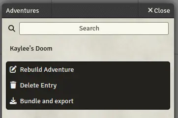
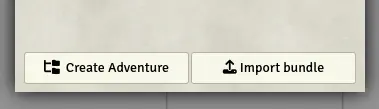

# Foundry Adventure Bundler

[**Changelog**](CHANGELOG.md)

Foundry V10 adds support for building [adventure documents](https://foundryvtt.com/article/adventure). This module takes
it one step further by adding support for importing and exporting adventures, bundling any custom assets and making it a
snap to share your work!

## Installation

You can install the module with the following manifest URL:

```plain
https://github.com/dmarcuse/fvtt-adventure-bundler/releases/latest/download/module.json
```

## Guide

The first thing you'll need in order to use this module is a compendium for adventures - which you can create from the
compendium sidebar.



With the module enabled and an adventure compendium created, you can then import/export adventure bundles!

### Exporting

Follow the [Foundry documentation on adventure documents](https://foundryvtt.com/article/adventure/) to build an
adventure. Once it's built, you can right click it in the compendium and select "Bundle and export" to bundle the
adventure with its assets and download it:



The module will automatically locate assets (excluding those provided by Foundry, modules, or URLs) and compress them
into a zip file. This file can then be imported, potentially on a different world or even Foundry instance.

### Importing

When opening an adventure compendium, you'll find a new "Import bundle" button:



Simply click the button, select your zile file, and the module will do the rest! Bundled assets will be uploaded to your
Foundry instance automatically, so all you need to do is import the adventure once the upload is complete. The directory
used for uploading assets can be changed in the module settings.
